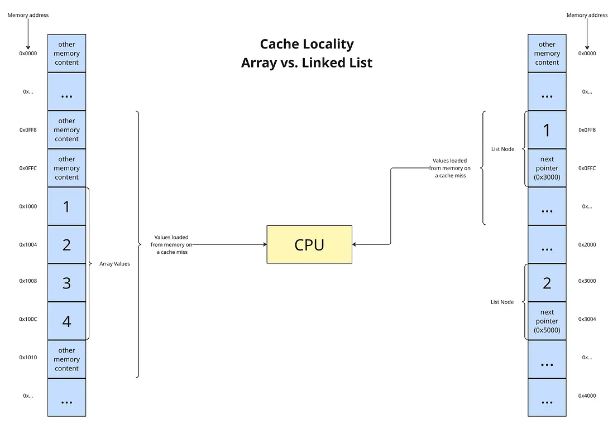

# Arrays

1. [Name & short definition](#name--short-definition)
2. [Core operations (API)](#core-operations-api)
3. [Time complexity for each operation](#time-complexity-for-each-operation)
4. [Space complexity](#space-complexity)
5. [Memory layout / implementation variants](#memory-layout--implementation-variants)
6. [Common implementations](#common-implementations)
7. [Invariants & constraints to maintain](#invariants--constraints-to-maintain)
8. [When to use / ideal use-cases](#when-to-use--ideal-use-cases)
9. [Typical interview problems / patterns that use it](#typical-interview-problems--patterns-that-use-it)
10. [Edge cases & pitfalls](#edge-cases--pitfalls)
11. [Practical tips & optimizations](#practical-tips--optimizations)
12. [Related data structures & trade-offs](#related-data-structures--trade-offs)


# Name & short definition

An array is a fundamental data structure that stores a collection of items (like integers, strings, or objects) of the same data type together in a single variable, accessed by a numerical index starting from 0. 

Arrays store elements in contiguous memory locations, allowing for efficient access and manipulation of multiple values, making them ideal for organizing related data, such as all scores for a student or names of players, without needing separate variables for each. 
Arrays are used to build other data structures like Stack Queue, Deque, Graph, Hash Table, etc. 

Random Access : i-th item can be accessed in O(1) Time as we have the base address and every item or reference is of same size.

# Core operations (API)


- Access: Accessing an element by its index (e.g., array[index])
- Insertion: Adding an element at a specific index (e.g., array.insert(index, value))
- Deletion: Removing an element from a specific index (e.g., array.pop(index) or del array[index])
- Search: Finding the index of a specific value (e.g., array.index(value))

# Time complexity for each operation

- Access: O(1)
- Insertion: O(n) (due to shifting elements)
- Deletion: O(n) (due to shifting elements)
- Search: O(n) (linear search)

# Space complexity

- Auxiliary Space: O(1) for operations, O(n) for storing n elements
- Total Space: O(n) for storing n elements

# Memory layout / implementation variants

Array memory layout means elements are stored sequentially in adjacent memory cells, allowing for quick address calculation using the formula: Address = Base_Address + (Index * Size_of_Element). This layout enables efficient random access, as each element can be directly accessed in constant time O(1) by calculating its memory address.

Arrays can be implemented in two primary ways:
1. Static Arrays: Fixed size, allocated at compile time. Example: C/C++ arrays.
2. Dynamic Arrays: Resizable, allocated at runtime. Example: Python lists, Java ArrayList.
3. Contiguous vs Linked: Contiguous arrays store elements in adjacent memory locations, while linked arrays use pointers to connect elements, allowing for dynamic resizing but with additional memory overhead.
4. multi-dimensional arrays: Arrays of arrays, e.g., 2D arrays for matrices.

# Common implementations

## Python Example

### Creating an array (list in Python)

```python
array = [1, 2, 3, 4, 5]
```
### Inserting an element

```python
array.insert(2, 10)  # Inserts 10 at index 2
```
### Deleting an element

```python
array.pop(3)  # Removes element at index 3
```
### Searching for an element

```python
index = array.index(10)  # Finds index of value 10
```

# Invariants & constraints to maintain

- Size/Bound Invariant: The size of the array `n` remains constant (for static arrays) or changes only through authorized resizing operations. 
- Any index `i` accessed must satisfy $0 \leq $`i`$ < n$.
- Type Homogeneity: All elements `A[i]` must be of the same declared data type.
- Initialization Invariant: An array must be fully initialized before its elements are read, or at least initialized to a default value (e.g., 0, null) to avoid undefined behavior. 


# When to use / ideal use-cases

Arrays store elements in contiguous memory locations, allowing for efficient access and manipulation of multiple values, making them ideal for organizing related data, such as all scores for a student or names of players, without needing separate variables for each. 

## Cache Friendliness 

Since items / references are stored at contiguous locations, we get the advantage of locality of reference.

When you run code on modern hardware, performance isn’t just about algorithmic complexity, it’s also about how well your data plays with the CPU cache. This is where arrays shine.

Arrays are stored in contiguous blocks of memory. That means when the CPU loads one element into cache, it often loads its neighbors too (due to spatial locality).

The following diagram shows why arrays tend to be cache-friendly compared to linked lists. Notice how array elements sit right next to each other in memory, while linked list nodes are scattered across different addresses.



So if you loop through an array:
```java
int[] numbers = {10, 20, 30, 40, 50};
for (int num : numbers) {
    System.out.println(num);
}
```
The CPU fetches chunks of memory in advance, making traversal blazing fast. You don’t notice it, but the hardware is quietly optimizing for you.

In contrast, a linked list scatters its nodes all over memory. Each node stores:
```java
class Node {
    int value;
    Node next;
}
```
When you traverse a linked list, the CPU can’t prefetch effectively — each `next` pointer could jump anywhere in memory. This leads to cache misses, forcing the CPU to stall and wait for data.


## Key Insights
An array is not useful in places where we have operations like insert in the middle, delete from middle and search in a unsorted data.


- Arrays shine at fast random access.
- They struggle with frequent insertions and deletions.
- Appending is efficient most of the time, but beware of the resize cost.
    - Why this matters in practice
    - If your program constantly inserts and removes in the middle, a linked list may be a better choice.
    - If you mostly read values or append at the end, arrays (or ArrayLists) are the clear winner.


# Typical interview problems / patterns that use it

# Edge cases & pitfalls

- Empty Array: An array with zero elements; often causes errors if not checked.
- Single-Element Array: Algorithms might break with just one item (e.g., sorting or finding min/max).
- Max/Min Values: Handling the largest/smallest possible numbers an element can hold, or array length.
- Null/Undefined Elements: Arrays containing null, undefined, or NaN values, which behave unexpectedly in comparisons.
- Duplicate Elements: Algorithms for unique items or grouping might need special logic for identical inputs.
- Reverse-Sorted/All Same: Inputs that are perfectly ordered or all identical can reveal inefficiencies.

# Practical tips & optimizations

Optimizing arrays involves managing memory efficiently, reducing unnecessary operations, and leveraging built-in functions to avoid slow, manual loops. Key strategies include pre-allocating memory, utilizing vectorization, and, in high-performance contexts, using "free index" management to avoid costly reallocations. 

## 1. Performance and Memory Optimization
- Pre-allocate Memory: When dealing with large arrays, determine the required size beforehand and allocate it once. This avoids the overhead of dynamic resizing and copying, which is crucial for performance-critical applications.
- Use Vectorized Operations (NumPy/Python): Replace explicit for-loops with vectorized operations. Using numpy functions for element-wise operations, math computations, and logical masking is significantly faster than Python loops.
- Avoid Repeated Concatenation: Instead of concatenating arrays within a loop, build a list and perform a single concatenation call at the end.
- Use In-Place Operations: Modify arrays in-place to save memory (e.g., arr += 1 instead of arr = arr + 1). This is crucial when working with large datasets that might exceed RAM.
- Memory Mapping (np.memmap): For datasets larger than RAM, use memory-mapped files to stream, chunk, and compress data, avoiding loading the entire array into memory.
- Downcast Data Types: Reduce memory usage by using smaller data types (e.g., float64 to float32 or uint8 for images). 

## 2. Algorithmic and Algorithmic Efficiency

- Two-Pointer Approach: Excellent for searching pairs in sorted arrays, reversing, or partitioning, operating in `O(n)` time.
- Sliding Window: Useful for subarray or substring problems, offering `O(n)` efficiency by maintaining a contiguous window.
- Prefix Sum/Difference Array: Use this to convert range queries (summation) to `O(1)` and range updates to `O(1)`.
- Kadane’s Algorithm: The standard, efficient approach for finding the maximum subarray sum.
- Binary Search on Answer: If the problem involves finding a maximum/minimum value, use binary search on the search space rather than just the index. 


# Related data structures & trade-offs

These comparisons showcase the strengths and trade-offs between arrays and various data structures, highlighting scenarios where each excels in terms of access patterns, memory management, and flexibility in handling different types of data. Understanding these distinctions is crucial for choosing the most suitable data structure based on specific requirements in programming and problem-solving.

## Arrays vs Linked Lists

| Arrays | Linked Lists |
|--------|--------------|
| Contiguous memory allocation facilitates direct access to elements by index | Elements are scattered in memory, each pointing to the next |
| Fixed size (static arrays) or requires resizing (dynamic arrays) | Dynamic size, can grow/shrink easily without reallocations |
| Constant-time access but less efficient insertions/deletions in the middle | Efficient insertions/deletions anywhere but slower access time |


## Arrays vs Stacks and Queues

| Arrays | Stacks/Queues |
|--------|--------------|
| Direct access to any element via index | Follows specific access patterns (LIFO for stacks, FIFO for queues) |
| Fixed or static size might restring the flexibility of implementing stack/queue | Can be implemented dynamically with linked lists or dynamic arrays |
| Efficient for random access but might involve shifting elements for insertions/deletions | Optimized for push/pop or enqueue/dequeue operations without shifting |

## Arrays vs Trees and Hash Tables

| Arrays | Trees/Hash Tables |
|--------|--------------|
| Efficient direct access via index | Optimized for hierarchical data (trees) or key-value pairs (hash tables) |
| Not suitable for mapping keys to values directly | Efficient search, insert, delete operations for dynamic data |
| Might be used for implementing static trees (e.g., heaps) |Not restricted by fixed size, offering more flexible data organization |


