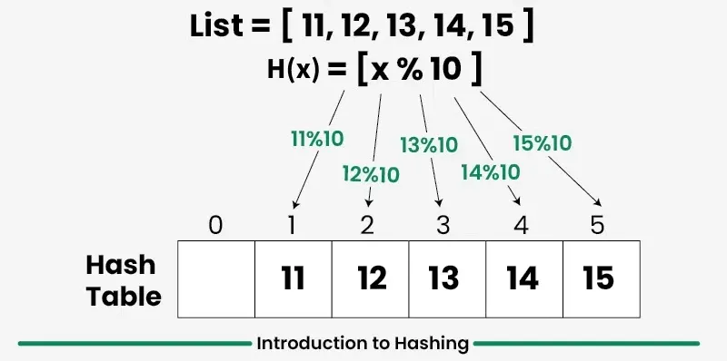
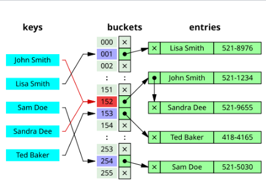
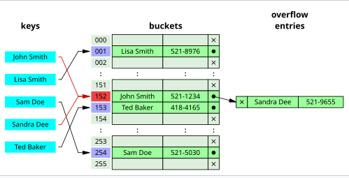

# Hash table/ Hash map

1. [Name & short definition](#name--short-definition)
2. [Core operations (API)](#core-operations-api)
3. [Time complexity for each operation](#time-complexity-for-each-operation)
4. [Space complexity](#space-complexity)
5. [Memory layout / implementation variants](#memory-layout--implementation-variants)
6. [Common implementations](#common-implementations)
7. [Invariants & constraints to maintain](#invariants--constraints-to-maintain)
8. [When to use / ideal use-cases](#when-to-use--ideal-use-cases)
9. [Typical interview problems / patterns that use it](#typical-interview-problems--patterns-that-use-it)
10. [Edge cases & pitfalls](#edge-cases--pitfalls)
11. [Practical tips & optimizations](#practical-tips--optimizations)
12. [Related data structures & trade-offs](#related-data-structures--trade-offs)

# Name & short definition

A hash table (or hash map) is a data structure that stores key-value pairs for highly efficient insertion, deletion, and retrieval, typically achieving average time complexity of `O(1)`. 

It uses a hash function to compute an index (hash code) into an array of buckets, determining where a specific value should be stored or found.

# Core operations (API)

- **Insert**: Adds a new key-value pair to the table by calculating the key's hash to find the appropriate bucket.
- **Search/Lookup**: Retrieves the value associated with a given key by hashing it to determine the index.
- **Delete**: Removes a key-value pair from the table, often using the same search mechanism to locate the element.
- **Collision Handling**: Resolves situations where different keys generate the same hash index, using techniques such as separate chaining (linked lists) or open addressing (linear/quadratic probing). 

# Time complexity for each operation

The core operations of a hash data structure are insertion, deletion, and searching (or lookup), which generally achieve `O(1)` average time complexity.

# Space complexity

The space complexity of a hash table is `O(n)`, where `n` is the number of key-value pairs stored in the table. This accounts for the storage of the keys, values, and any additional overhead from the underlying array and collision resolution structures.

# Memory layout / implementation variants

A hash table is fundamentally structured in memory as a contiguous array of buckets or slots. A hash function calculates an index for a key, mapping it to a specific slot within this array. 

Each slot typically holds a key-value pair, or a reference/pointer to a node (in chained hashing). 

# Common implementations

Load factor
A load factor 
α
{\displaystyle \alpha } is a critical statistic of a hash table, and is defined as follows:[2]
load factor
 
`α = n/m`

where
n is the number of entries occupied in the hash table.
m is the number of buckets.

The performance of the hash table deteriorates in relation to the load factor 
`α`. 

In the limit of large `m` and `n`, each bucket statistically has a Poisson distribution with expectation `λ = α` for an ideally random hash function.

The software typically ensures that the load factor 
`α` remains below a certain constant, `α_max`. 

This helps maintain good performance. Therefore, a common approach is to resize or "rehash" the hash table whenever the load factor `α` reaches `α_max`. 

Similarly the table may also be resized if the load factor drops below 
`α_max/4`, to avoid wasting space.

## Separate chaining

In separate chaining, the process involves building a linked list with key–value pair for each search array index. 

The collided items are chained together through a single linked list, which can be traversed to access the item with a unique search key.

If the keys are ordered, it could be efficient to use "self-organizing" concepts such as using a self-balancing binary search tree, through which the theoretical worst case could be brought down to `O(logn)` although it introduces additional complexities.

### Caching and locality of reference

The linked list of separate chaining implementation may not be cache-conscious due to spatial locality of reference when the nodes of the linked list are scattered across memory, thus the list traversal during insert and search may entail CPU cache inefficiencies.

In cache-conscious variants of collision resolution through separate chaining, a dynamic array found to be more cache-friendly is used in the place where a linked list or self-balancing binary search trees is usually deployed, since the contiguous allocation pattern of the array could be exploited by hardware-cache prefetchers such as translation lookaside buffer resulting in reduced access time and memory consumption.

## Open addressing

Open addressing is another collision resolution technique in which every entry record is stored in the bucket array itself, and the hash resolution is performed through probing. 

When a new entry has to be inserted, the buckets are examined, starting with the hashed-to slot and proceeding in some probe sequence, until an unoccupied slot is found. 

When searching for an entry, the buckets are scanned in the same sequence, until either the target record is found, or an unused array slot is found, which indicates an unsuccessful search.

# Invariants & constraints to maintain

## Load factor for separate chaining
With separate chaining hash tables, each slot of the bucket array stores a pointer to a list or array of data.

Separate chaining hash tables suffer gradually declining performance as the load factor grows, and no fixed point beyond which resizing is absolutely needed.

With separate chaining, the value of 
`α_max` that gives best performance is typically between **1 and 3**.

## Load factor for open addressing
With open addressing, each slot of the bucket array holds exactly one item. Therefore an open-addressed hash table cannot have a load factor greater than 1.

The performance of open addressing becomes very bad when the load factor approaches 1.

Therefore a hash table that uses open addressing must be resized or rehashed if the load factor `α` approaches 1.
With open addressing, acceptable figures of max load factor 
`α_max` should range around 0.6 to 0.75.

# When to use / ideal use-cases

The most valuable aspect of a hash table over other abstract data structures is its speed to perform insertion, deletion, and search operations. 
Hash tables can do them all in constant time.
This makes hash tables ideal for scenarios where fast lookups and updates are critical.

# Typical interview problems / patterns that use it

# Edge cases & pitfalls

## Edge Cases

- **High Collision Rates**: When many keys hash to the same index, performance degrades. This can happen with poor hash functions or when the load factor is too high.
- **Resizing**: When the hash table exceeds its load factor threshold, resizing (rehashing) is necessary, which can be costly in terms of time and memory.
- **Null Keys/Values**: Some implementations allow null keys or values, which can lead to unexpected behavior if not handled properly.

## Common Pitfalls

- **Mutable Keys**: If a key object's properties change after it is added to the map, its `hashCode()` changes, making it impossible to retrieve or remove that entry.
- **Thread Safety**: Standard HashMaps are not thread-safe. Modifying them while iterating, or simultaneous access by multiple threads, causes `ConcurrentModificationException` or data corruption.
- **Assuming Key Order**: HashMaps do not guarantee order. Iterating over them can yield different orders across executions.
- **Overwriting Keys**: Using `put()` without checking if a key already exists can cause unintended data loss.
- **Poor `equals()/hashCode()` Implementation**: Failing to override both methods (or implementing them incorrectly) leads to improper behavior in finding existing keys.
- **Misinterpreting `Null` Returns**: In some languages, a `get()` returning `null` could mean either the key is absent or the key exists with a `null` value.

# Practical tips & optimizations

- **Immutable Keys**: Use immutable objects (like String, Integer, or Record) for keys to prevent hashcode changes after insertion, which can make entries unretrievable.
- **Efficient hashCode()**: Ensure `hashCode()` is fast and distributes keys uniformly to minimize collisions. Avoid naive implementations that cause clustering.
- **Avoid Object Creation**: Do not repeatedly create new key objects if you can reuse them, especially for compound keys. 

# Related data structures & trade-offs

# References

- [Hash table - Wikipedia](https://en.wikipedia.org/wiki/Hash_table)